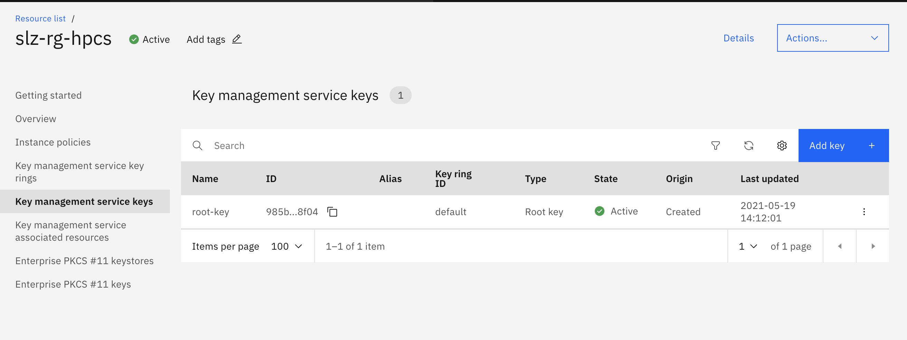

# terraform-ibm-hpcs-kms-key
This terraform module creates KMS root key in HPCS instance

## Terraform versions

Terraform 0.13.

## Prerequisite
* HPCS instance created and initialized.

## Example Usage
* Copy the module decleration from [here](./test/stages/stage0.tf) to the main.tf and variables with their values as in [variable example](./test/stages/variables.tf) variables.tf files and run the terraform.
```hcl
  terraform validate
  terraform init
  terraform plan
  terraform apply
```

## Module and their required input variable details:

```terraform

module "kms_key" {
  # source           = "git::https://github.com/slzone/terraform-ibm-hpcs-kms.key.git"
  source           = "git::https://github.com/slzone/terraform-ibm-hpcs-kms-key.git?ref=hpcs-kms-dev"
  ibmcloud_api_key = var.ibmcloud_api_key
  name             = var.name
  standard_key     = var.standard_key
  instance_id      = var.hpcs_instance_guid
  force_delete     = var.force_delete
  endpoint_type    = var.endpoint_type
  key_material     = var.key_material
  encrypted_nonce  = var.encrypted_nonce
  iv_value         = var.iv_value
  expiration_date  = var.expiration_date
  interval_month   = var.interval_month
  dual_auth_delete = var.dual_auth_delete
  region           = var.region
  hpcs_port        = var.hpcs_port
}

```

### Inputs

| Name              | Description                                                             | Type     |Required |
|-------------------|------------------------------------------------------------------------ |----------|---------|
| ibmcloud_api_key| Api key.                                               | `string` | Yes     |
| hpcs_instance_guid| GUID of Service Instance.                                               | `string` | Yes     |
| region            | Region.                                                                 | `string` | Yes     |   
| name              | Key Name.                                                               | `string` | Yes     |
| standard_key      | Determines if it is a standard key or not.                              | `bool`   | No      | 
| force_delete      | First admin name.                                                       | `bool`   | No      |
| endpoint_type     | Endpoint type of the Key.                                               | `string` | No      |
| key_material      | key_material of the Key.                                                | `string` | No      |
| encrypted_nonce   | Encrypted_nonce of the Key.                                             | `string` | No      |
| iv_value          | Iv_value of the Key                                                     | `string` | No      |
| expiration_date   | Expiration_date of the Key.                                             | `string` | No      |
| interval_month    | Key rotation interval in months.                                        | `string` | No      |
| dual_auth_delete  | Determine dual auth deletion.                                           | `bool`   | Yes     |
| hpcs_port         | HPCS service port number.                                               | `number` | Yes     |


## Outputs
| Name         | Description     |
|--------------|-----------------|
| key          | KMS Key Details.|


## Validation Steps: 

* Would be able to see the KMS key details at the end of Terraform apply as:

```hcl
module.kms_key.null_resource.enable_key_rotaion_policy: Creation complete after 1s [id=1675264934760880326]
```

* Also can be verified from the IBMCLOUD console as shown:

